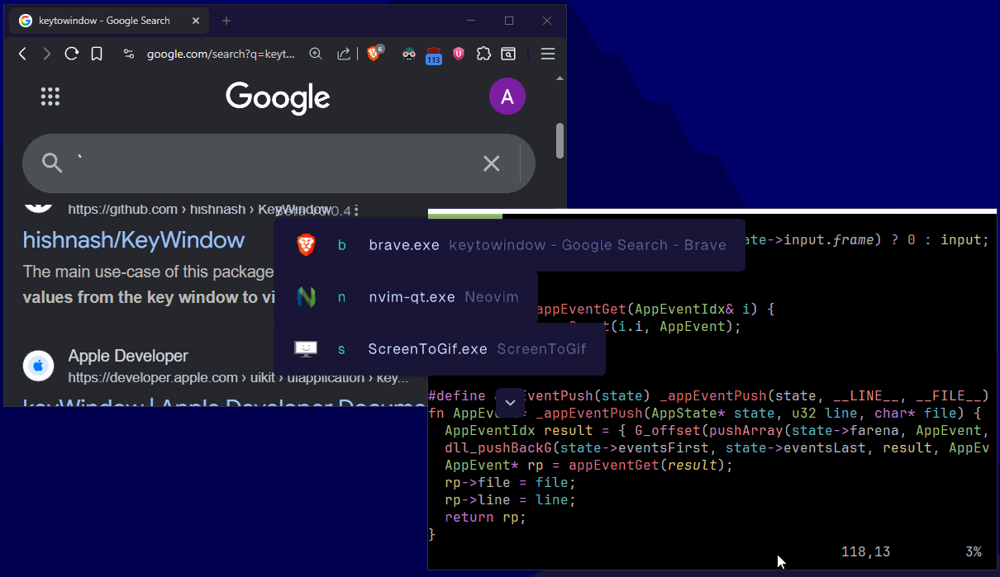
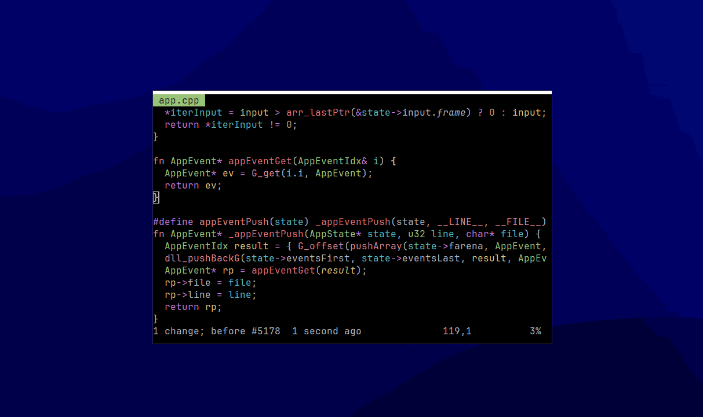
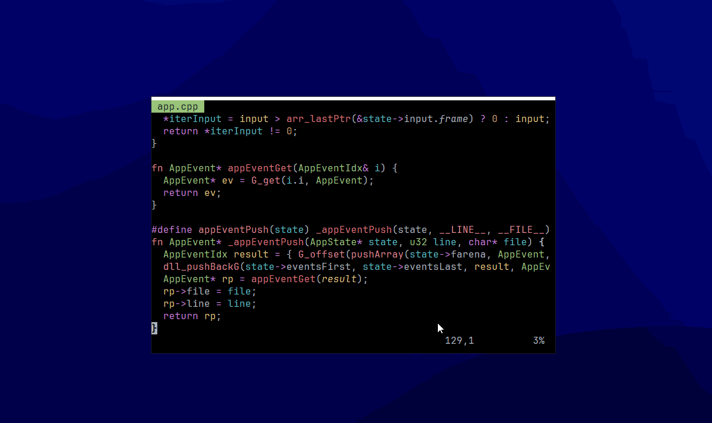
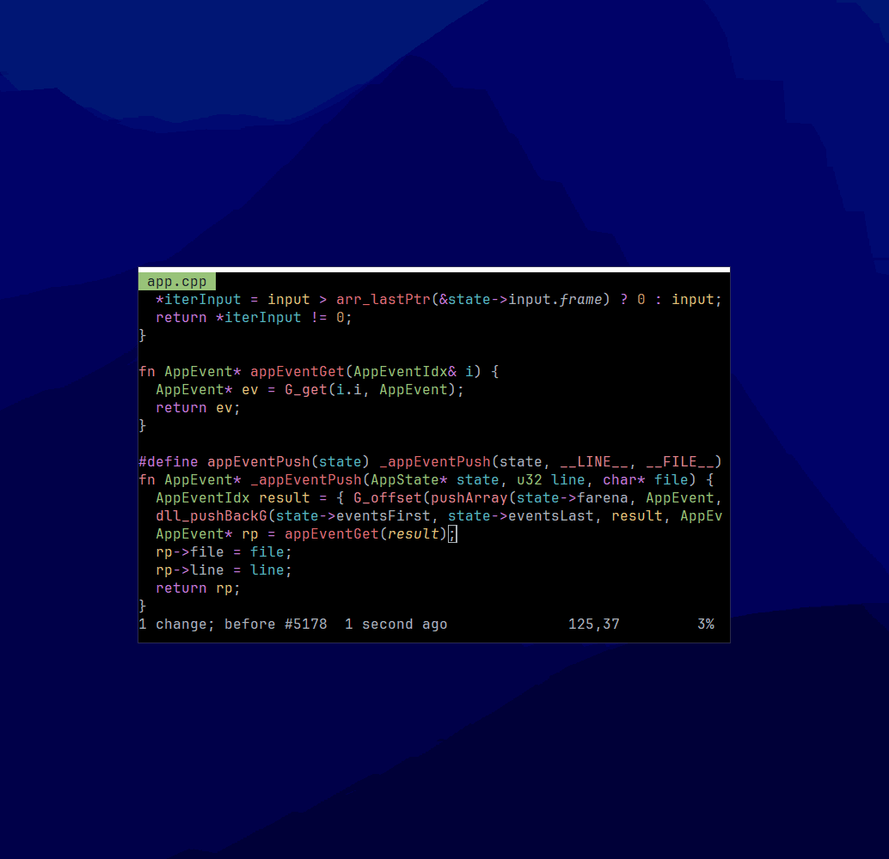

# Quick Switch
Pre-release Alt-Tab replacement. Swap apps by typing the first letter of it's name.

!!! This page is not up-to-date anymore, newer releases here: https://www.patreon.com/posts/156207317

Alt-caps (can remap) to activate.

Rightclick to remap a program.

Alt-ctrl-caps (can remap) to remap the focused window until restart.

Rightclick -> Settings:
  * Autostart program
  * Change mappings
  * Fallback resolve sequence are the keys added when the same program is opened twice, to resolve conflicts

Scale ui with ctrl+mousewheel

## Installation
Download from releases and place 2MB binary anywhere you want, run.

Config is stored in appdata.

## Known issues
* Only ASCII characters rendered so far

### Disclaimer
Stuff will most likely break and be buggy.

You can create issues or email me at realadambasis@gmail.com for bugs.

Thank you for trying it out.

#### Future
Some of this is already implemented in my private branch:
* Closing/opening 1 or more programs
* Grouping windows to 1 key
* Manual/Auto tiling and layouting
* Blacklist, ignore windows
* Nth window map
* Use window metadata like title, icon, etc. to change maps
* Maps across desktops
* Maybe: search and find programs on entire computer to start/open/tile/...
* Expand settings to be able to do more stuff like changing, expressions etc.

Checkout my YouTube: https://www.youtube.com/@AdamBasis
